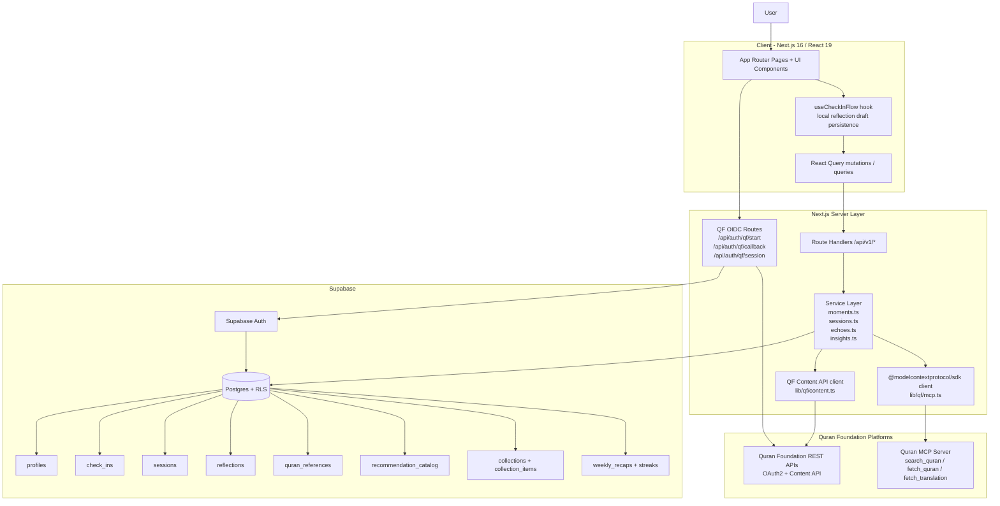

# TECHNICAL.md

## 1. Architecture & Component Hierarchy



### How It All Fits Together

CompassQ is a thin-client, server-driven Next.js app. The client handles interaction state and resilience UX (draft persistence, optimistic updates). The server handles identity, recommendation logic, persistence, and third-party API orchestration.

The main runtime flow looks like this:

1. User picks a check-in category in the React UI.
2. `src/lib/ui/home/use-check-in-flow.ts` fires React Query mutations for check-in creation, verse recommendation, reflection persistence, and session completion (with optional `resonanceScore`).
3. Route handlers under `src/app/api/v1/*` validate incoming payloads with Zod — most schemas live in `src/lib/contracts.ts`, though some routes define inline schemas for endpoint-specific validation.
4. Server services run business logic against Supabase using a user-scoped `ServiceContext` (defined in `src/lib/types.ts`).
5. If verse content isn't cached locally, the service falls through to Quran Foundation REST content APIs via `src/lib/qf/content.ts` and upserts the normalized verse into `quran_references`.
6. After session completion, the Echoes flow calls the Quran MCP server via `@modelcontextprotocol/sdk` to do semantic retrieval of related verses.
7. Weekly insight materialization writes aggregate state into `weekly_recaps`, while resonance scores on `sessions` shape future recommendations.

What this architecture demonstrates:

- Explicit API contracts with Zod validation
- Clean separation between client state and durable server state
- Database-enforced user isolation via RLS
- Multi-API composition (Supabase + QF Content + QF MCP) rather than single-endpoint dependency

## 2. Key Technical Decisions

### Why Vector Semantic Search?

Keyword search doesn't work well for spiritual reflection — users rarely think in exact verse wording. CompassQ uses the Quran MCP `search_quran` tool to retrieve verses that are thematically related to a completed session, not just lexically similar.

The query construction in `src/lib/services/echoes.ts` combines two signals:

- The normalized emotional category (e.g. `need_comfort`, `feeling_distant`)
- The first 200 characters of the current verse translation

This composite query acts as a semantic fingerprint of the user's emotional state plus the textual context they just engaged with. Category-only search would collapse nuance; free-text-only search would drift toward surface similarity without affective context.

From an API-usage perspective, CompassQ isn't using MCP as a generic transport wrapper. It's using the model-context protocol for its intended strength: tool-mediated retrieval over semantically indexed Quranic content, blended with local application state.

### Why Closed-Loop Resonance Weighting?

Most hackathon recommendation systems are open-loop: recommend, display, forget. CompassQ closes the loop by persisting an explicit `resonance_score` on `sessions` and feeding that history back into future verse selection.

The implementation in `src/lib/services/moments.ts` (`loadCategoryResonanceWeights()`) computes a rolling 30-day average of resonance scores, grouped by the originating `check_ins.category`. This creates a user-personalized preference signal without needing heavy ML infrastructure.

Why this design works for this product:

- It's explainable — you can reason about the weighting from database rows alone.
- It's sparse-data tolerant — even a handful of ratings gives useful signal.
- It avoids hard lock-in — high-resonance categories get a soft preference, not deterministic replay.
- It respects spiritual exploration — variety is preserved through partial randomization rather than greedy top-1 reuse.

Concretely, when the average category resonance is `>= 3.5`, the candidate set is reordered using a partial Fisher-Yates shuffle on the top half of the list. This strengthens what has historically resonated while avoiding repetitive output.

### Why Local Offline Draft Persistence?

Reflection writing is the highest-friction moment in the user flow. Losing a draft due to a transient mutation error or accidental navigation would directly damage trust.

CompassQ mitigates this by persisting reflection drafts in `window.localStorage` using a session-scoped key:

```
compassq:reflection-draft:${sessionId}
```

This lives in `src/lib/ui/home/use-check-in-flow.ts`.

Why this is the right tradeoff:

- Reflections are user-generated and emotionally sensitive — draft durability matters.
- Persisting locally avoids premature server writes of partial thoughts.
- Session-scoped keys prevent cross-session collision.
- The draft is cleared on successful save or when the flow advances.

This keeps ephemeral recovery state on the client while canonical reflection records live in Supabase. That separation is both privacy-aware and operationally efficient.

### Why Cache Quran References Locally?

CompassQ uses `quran_references` as a local normalized cache for Arabic text, translation, tafsir snippet, and audio URL. The service path checks cached content first via `getCachedAyahPayload` (defined in `src/lib/qf/content.ts`), then falls through to `fetchQfAyahByKey`, and upserts the result back into Supabase.

This improves:

- Latency for repeat verse retrieval
- Resilience against upstream API intermittency
- Cost and rate-limit posture
- Display determinism — previously normalized verse payloads remain stable

This matters because the recommendation and echo flows are user-facing, synchronous, and emotionally immediate. Cache-first retrieval reduces the chance that third-party API jitter interrupts the contemplative experience.

## 3. Deep Technical Implementation

### Quran Echoes via MCP

The Echoes feature is implemented in `src/lib/services/echoes.ts` and `src/lib/qf/mcp.ts`. It's a protocol-level API composition, not a thin REST wrapper.

#### MCP Client Initialization

`src/lib/qf/mcp.ts` initializes a singleton MCP client:

```ts
const transport = new StreamableHTTPClientTransport(new URL(MCP_URL))
const client = new Client(
  { name: 'compassq', version: '1.0.0' },
  { capabilities: {} },
)
await client.connect(transport)
```

Key details:

- Uses `StreamableHTTPClientTransport` — protocol-native, not custom-fetch based
- The client promise is memoized to prevent reconnect churn across requests
- A `grounding_nonce` is fetched once via `fetch_grounding_rules` and reused on subsequent calls

The nonce bootstrap is handled by `ensureNonce(client)` and is intentionally non-fatal. If nonce acquisition fails, tool calls still proceed without it.

#### Semantic Search Execution

The search operation is `searchQuran(opts)`:

```ts
const res = await client.callTool({
  name: 'search_quran',
  arguments: {
    query: opts.query,
    translations: opts.translations ?? 'en-sahih-international',
    grounding_nonce: nonce,
  },
})
```

The result parser (`extractStructured()`) is defensive — it first prefers `structuredContent`, then falls back to parsing the first text payload as JSON, and finally preserves raw text if parsing fails.

`searchQuran()` then normalizes three possible payload shapes:

- Direct array
- Object with `results`
- Object with `verses`

This is an API-hardening decision: CompassQ tolerates minor upstream envelope changes without breaking.

#### Echo Query Construction

In `findEchoes(ctx, sessionId)`, CompassQ loads the completed session and its originating category:

```ts
.from('sessions')
.select('ayah_key, check_ins(category)')
.eq('id', sessionId)
.eq('user_id', ctx.userId)
.eq('completed', true)
```

It then loads the current verse translation from `quran_references` and builds a semantic query:

```ts
`${category.replace(/_/g, ' ')} - ${translationText.slice(0, 200).trim()}`
```

This turns a discrete emotional category plus a concrete verse excerpt into a semantically searchable prompt.

#### Parsing Results into a Thread

The semantic result is transformed into an "echo thread" in four stages:

1. **Anchor** — The current verse is the anchor node. Its `ayah_key` goes into `seenKeys` first so the thread can't reflexively point back to itself.

2. **Verse-key normalization** — `extractVerseKey(result)` checks `result.ayah_key`, `result.verse_key`, and any nested string matching `/^\d+:\d+$/`. This treats the MCP response as semi-structured rather than tightly coupled.

3. **Content resolution cascade** — Each result is resolved in priority order:
   - Direct extraction from the MCP result via `extractEchoFromMcpResult`
   - Local Supabase cache via `quran_references`
   - Quran Foundation Content API via `fetchQfAyahByKey`

   If the MCP result already includes Arabic text and translation, CompassQ skips the extra network hop.

4. **Thread finalization** — Results are filtered, deduplicated, shuffled for freshness, and trimmed to `ECHO_LIMIT = 1`. The output is a concise sequential continuation — current verse followed by one semantically adjacent verse — which reads as a guided thread rather than a search result list.

#### Why This MCP Implementation Works

- Uses the official `@modelcontextprotocol/sdk` instead of custom protocol emulation
- Resilient to payload shape variance
- Composes semantic retrieval with local relational state
- Degrades gracefully (empty result) rather than catastrophically (crash)

### Verse Resonance Closed Loop

The resonance system turns subjective user feedback into a lightweight adaptive recommender.

#### Input Collection

The route `src/app/api/v1/sessions/[id]/complete/route.ts` accepts:

```ts
const bodySchema = z.object({
  resonanceScore: z.number().int().min(1).max(5).nullish(),
})
```

This schema is defined inline in the route handler. Only integers 1-5 are allowed, and omission is valid (preserving low-friction completion).

On the client, `useCheckInFlow()` holds `resonanceScore` in local state and passes it into `completeSession(sessionId, resonanceScore)`.

#### Database Persistence

The score is stored on `public.sessions.resonance_score smallint`, introduced by migration `20260520110000_add_resonance_score.sql`. A partial index is created for efficient lookup:

```sql
create index ... on public.sessions (user_id, resonance_score)
where resonance_score is not null;
```

This makes sense because scoring queries only care about completed, rated sessions.

#### Closed-Loop Weighting

The recommendation service computes category-level historical resonance in `loadCategoryResonanceWeights()`:

1. Query all completed sessions in the last 30 days for the current user.
2. Join through `check_ins!inner(category)`.
3. Filter out null `resonance_score`.
4. Group scores in memory by category.
5. Compute arithmetic mean per category.

The formula:

```
avg_resonance(category) = sum(resonance_score_i) / count(rated_sessions_i)
```

This produces a `Map<string, number>` keyed by category.

#### How It Affects Future Recommendations

When `recommendMoment()` loads candidate verses for the user's current category, it evaluates:

```ts
const shouldUseWeightedSelection =
  categoryWeight != null && categoryWeight >= 3.5 && candidates.length > 1
```

If true, CompassQ:

1. Keeps the category as the primary recommendation partition.
2. Moves the last-used `ayah_key` to the back to avoid immediate repetition.
3. Performs a partial Fisher-Yates shuffle on the top half of the candidate list.

The state transition:

```
user rating -> sessions.resonance_score -> 30-day category average
-> soft candidate reordering -> future verse selection bias
```

That's the closed loop.

#### Why This Scoring Model Fits

- Computationally cheap
- Transparent enough to explain to judges and users
- Avoids overfitting because output remains probabilistic
- Can be upgraded to a bandit or embedding-based system later without changing the product contract

#### Weekly Resonance Analytics

`src/lib/services/insights.ts` provides secondary analytical use of the same signal through an internal `computeResonanceInsights()` helper (called by the exported `getWeeklyInsights()` function):

- `averageScore`
- `totalRated`
- `highestAyahKey`
- `highestScore`
- `categoryAverages`

The same primitive supports both personalization and reflective user insight.

## 4. Security Posture & Database Schema

### Security Posture

CompassQ enforces data isolation at three layers:

1. **Application-layer** — Auth gates in Next.js route handlers via `requireApiUser()`.
2. **Query-layer** — User-scoped `ServiceContext` ensures queries are always filtered by `userId`.
3. **Database-layer** — Row Level Security on every user-owned table.

Even if a handler accidentally broadens a query, Postgres RLS prevents cross-user reads and writes.

### Auth Integration: Supabase + QF OIDC

CompassQ uses two auth domains for different trust boundaries.

#### Supabase Auth (primary application identity)

- `profiles.id` is a foreign key to `auth.users.id`
- A trigger `handle_new_user_profile()` auto-provisions a `profiles` row on signup
- All user-owned domain tables reference `profiles(id)` via `user_id`

This is the canonical identity boundary for application data.

#### Quran Foundation OAuth/OIDC (external ecosystem connectivity)

`src/lib/qf/oidc.ts` and the routes under `src/app/api/auth/qf/*` implement Authorization Code + PKCE:

- `/api/auth/qf/start` generates `state`, `code_verifier`, and `code_challenge`
- `state` and verifier are stored in `httpOnly` cookies
- `/api/auth/qf/callback` validates `state` before token exchange
- Tokens are stored in `httpOnly`, `sameSite=lax` cookies
- `getQfAccessToken()` refreshes the token if it's within 60 seconds of expiry

Security details:

- CSRF protection via state comparison
- PKCE challenge method `S256`
- Refresh tokens never exposed to client JavaScript
- Cookie `secure` flag enabled in production
- Redirect destinations constrained through `getSafeRedirect()`

QF OAuth tokens are handled as separate external capability tokens, while app data access remains tied to Supabase identity and RLS.

### Database Schema

#### Enum Types

| Type | Values | Purpose |
| --- | --- | --- |
| `public.check_in_category` | `anxiety`, `gratitude`, `patience`, `guidance`, `hope`, `discipline`, `feeling_distant`, `need_comfort` | Emotional/reflective routing taxonomy |

#### Tables

##### `public.profiles`

| Column | Type | Notes |
| --- | --- | --- |
| `id` | `uuid` | PK, references `auth.users(id)` |
| `display_name` | `text` | Optional |
| `timezone` | `text` | Defaults to `UTC` |
| `created_at` | `timestamptz` | |
| `updated_at` | `timestamptz` | Auto-maintained by trigger |

##### `public.quran_references`

| Column | Type | Notes |
| --- | --- | --- |
| `id` | `uuid` | PK |
| `source` | `text` | Defaults to `qf` |
| `surah_number` | `integer` | `> 0` |
| `ayah_number` | `integer` | `> 0` |
| `ayah_key` | `text` | Unique, format `2:286` |
| `arabic_text` | `text` | Cached |
| `translation_text` | `text` | Cached |
| `tafsir_snippet` | `text` | Cached |
| `audio_url` | `text` | Cached |
| `created_at` | `timestamptz` | |
| `updated_at` | `timestamptz` | Auto-maintained by trigger |

##### `public.recommendation_catalog`

| Column | Type | Notes |
| --- | --- | --- |
| `id` | `uuid` | PK |
| `category` | `public.check_in_category` | Recommendation partition |
| `ayah_key` | `text` | FK to `quran_references(ayah_key)` |
| `priority` | `integer` | Lower = earlier |
| `is_active` | `boolean` | Active/inactive switch |
| `created_at` | `timestamptz` | |

##### `public.check_ins`

| Column | Type | Notes |
| --- | --- | --- |
| `id` | `uuid` | PK |
| `user_id` | `uuid` | FK to `profiles(id)` |
| `category` | `public.check_in_category` | Emotional state selection |
| `notes` | `text` | Optional freeform |
| `created_at` | `timestamptz` | |
| `local_date` | `date` | For daily reuse and streak logic |

##### `public.sessions`

| Column | Type | Notes |
| --- | --- | --- |
| `id` | `uuid` | PK |
| `user_id` | `uuid` | FK to `profiles(id)` |
| `check_in_id` | `uuid` | FK to `check_ins(id)` |
| `ayah_key` | `text` | FK to `quran_references(ayah_key)` |
| `completed` | `boolean` | Defaults to `false` |
| `created_at` | `timestamptz` | |
| `resonance_score` | `smallint` | Nullable, constrained 1-5 |

##### `public.reflections`

| Column | Type | Notes |
| --- | --- | --- |
| `id` | `uuid` | PK |
| `user_id` | `uuid` | FK to `profiles(id)` |
| `session_id` | `uuid` | FK to `sessions(id)` |
| `ayah_key` | `text` | FK to `quran_references(ayah_key)` |
| `content` | `varchar(280)` | Enforced 1-280 chars |
| `created_at` | `timestamptz` | |

##### `public.bookmarks`

| Column | Type | Notes |
| --- | --- | --- |
| `id` | `uuid` | PK |
| `user_id` | `uuid` | FK to `profiles(id)` |
| `ayah_key` | `text` | FK to `quran_references(ayah_key)` |
| `created_at` | `timestamptz` | |

##### `public.collections`

| Column | Type | Notes |
| --- | --- | --- |
| `id` | `uuid` | PK |
| `user_id` | `uuid` | FK to `profiles(id)` |
| `name` | `text` | Unique per user, 1-120 trimmed chars |
| `created_at` | `timestamptz` | |

##### `public.collection_items`

| Column | Type | Notes |
| --- | --- | --- |
| `id` | `uuid` | PK |
| `collection_id` | `uuid` | FK to `collections(id)` |
| `ayah_key` | `text` | FK to `quran_references(ayah_key)` |
| `created_at` | `timestamptz` | |

##### `public.streaks`

| Column | Type | Notes |
| --- | --- | --- |
| `user_id` | `uuid` | PK, FK to `profiles(id)` |
| `current_streak_days` | `integer` | `>= 0` |
| `longest_streak_days` | `integer` | `>= 0` |
| `last_active_local_date` | `date` | Last completed day |
| `created_at` | `timestamptz` | |
| `updated_at` | `timestamptz` | Auto-maintained by trigger |

##### `public.weekly_recaps`

| Column | Type | Notes |
| --- | --- | --- |
| `id` | `uuid` | PK |
| `user_id` | `uuid` | FK to `profiles(id)` |
| `week_start_date` | `date` | Unique per user/week |
| `return_days` | `integer` | `>= 0` |
| `top_categories` | `jsonb` | Aggregated category counts |
| `top_ayah_keys` | `jsonb` | Aggregated verse counts |
| `reflection_count` | `integer` | `>= 0` |
| `created_at` | `timestamptz` | |

### Row Level Security

RLS is enabled on all user-owned tables: `profiles`, `check_ins`, `sessions`, `reflections`, `bookmarks`, `collections`, `collection_items`, `streaks`, `weekly_recaps`.

#### Direct ownership tables

For most tables:

```sql
using (auth.uid() = user_id)
with check (auth.uid() = user_id)
```

This covers select, insert, update, and delete — all scoped to the authenticated user. Applied to `check_ins`, `sessions`, `reflections`, `bookmarks`, `collections`, `streaks`, and `weekly_recaps`.

#### Profile policy

`profiles` compares against `id` (since `profiles.id` is the user identity key):

```sql
using (auth.uid() = id)
with check (auth.uid() = id)
```

#### Indirect ownership: `collection_items`

`collection_items` doesn't store `user_id` directly, so ownership is enforced via subquery:

```sql
exists (
  select 1
  from public.collections
  where collections.id = collection_items.collection_id
    and collections.user_id = auth.uid()
)
```

This prevents a user from attaching items to another user's collection even if they guess a UUID.

### Data Isolation Guarantees

- One user's reflections cannot be read by another user
- One user's sessions and resonance history cannot influence another user's personalized loop
- Collection and bookmark mutations cannot cross account boundaries
- QF OAuth tokens are stored server-side in `httpOnly` cookies, not in browser-accessible storage

## 5. Environment Variables & Deployment

### Environment Variables

| Variable | Required | Example | Purpose |
| --- | --- | --- | --- |
| `NEXT_PUBLIC_SUPABASE_URL` | Yes | `https://xxxx.supabase.co` | Supabase project URL |
| `NEXT_PUBLIC_SUPABASE_PUBLISHABLE_DEFAULT_KEY` | Yes (or fallback) | `sb_publishable_XXX` | Preferred publishable key for Supabase client |
| `NEXT_PUBLIC_SUPABASE_ANON_KEY` | Fallback | `sb_publishable_XXX` | Backward-compatible fallback (read by `src/lib/supabase/env.ts`) |
| `NEXT_PUBLIC_APP_URL` | Yes | `http://localhost:3001` | Canonical app URL for QF OIDC redirect URI |
| `QF_CONTENT_ENV` | Yes | `production` or `prelive` | Selects QF Content OAuth and API base URLs |
| `QF_CONTENT_CLIENT_ID` | Yes | provided by QF | Client credentials for QF Content API |
| `QF_CONTENT_CLIENT_SECRET` | Yes | provided by QF | Secret for Content API client credentials flow |
| `QF_CONTENT_TRANSLATION_RESOURCE_ID` | Optional | `85` | Translation resource override |
| `QF_CONTENT_TAFSIR_RESOURCE_ID` | Optional | `169` | Tafsir resource override |
| `QF_CONTENT_RECITATION_ID` | Optional | `1` | Audio recitation resource override |
| `QF_USER_ENV` | Yes (for QF linking) | `production` or `prelive` | Selects QF OIDC environment |
| `QF_USER_CLIENT_ID` | Yes (for QF linking) | provided by QF | Client ID for Auth Code + PKCE flow |
| `QF_USER_CLIENT_SECRET` | Yes (for QF linking) | provided by QF | Client secret for token exchange/refresh |
| `QURAN_MCP_URL` | Optional | `https://mcp.quran.ai/` | Quran MCP server endpoint (defaults to public URL) |
| `VERCEL_URL` | Platform-provided | `your-app.vercel.app` | Fallback for deriving app URL in hosted environments |
| `NODE_ENV` | Platform-provided | `production` | Controls `secure` cookie flag |

### Deployment Notes

CompassQ needs three external integrations configured:

1. Supabase project URL + publishable key
2. Quran Foundation Content API credentials
3. Quran Foundation User OIDC credentials

The MCP server is optional — the core verse recommendation flow works without it, but the Echoes feature becomes non-operational and gracefully returns an empty result set.

### Troubleshooting

#### OIDC callback fails with `state_mismatch`

Likely cause: cookies were blocked, cleared, or the app URL changed mid-flow.

Check:
- `NEXT_PUBLIC_APP_URL` exactly matches the browser origin
- The QF redirect URI matches `/api/auth/qf/callback`
- You're not switching between `localhost` ports during login

#### Supabase initializes but auth-protected routes fail

Likely cause: `NEXT_PUBLIC_SUPABASE_URL` or publishable key is missing/inconsistent.

Check:
- `src/lib/supabase/env.ts` accepts either `NEXT_PUBLIC_SUPABASE_PUBLISHABLE_DEFAULT_KEY` or `NEXT_PUBLIC_SUPABASE_ANON_KEY`
- Your local environment uses one of those names exactly

#### Quran Moment recommendation fails with "Quran Foundation content API is not configured"

Likely cause: missing `QF_CONTENT_CLIENT_ID` or `QF_CONTENT_CLIENT_SECRET`.

Check:
- Both variables are set
- `QF_CONTENT_ENV` matches the credential environment

#### Echoes returns empty even though the rest of the app works

Likely cause: `QURAN_MCP_URL` is unreachable or the MCP server returned an error.

Check:
- Network access to `https://mcp.quran.ai/`
- Server logs for `[echoes] MCP search failed`

This is expected graceful degradation, not a full outage.

#### Reflection drafts appear to disappear

Likely cause: the session was completed (which clears the draft), browser storage was cleared, or the user started a different session (changing the storage key).

Check:
- The current session ID in the UI flow
- Local storage keys matching `compassq:reflection-draft:${sessionId}`

## Summary

CompassQ combines:

- Protocol-native MCP integration for semantic Quran retrieval
- Cache-first REST integration for canonical verse content
- Adaptive recommendation logic driven by persisted user feedback
- Zod-validated route contracts
- Database-enforced row isolation with comprehensive RLS
- Production-grade OAuth with PKCE, refresh, state validation, and `httpOnly` cookie storage